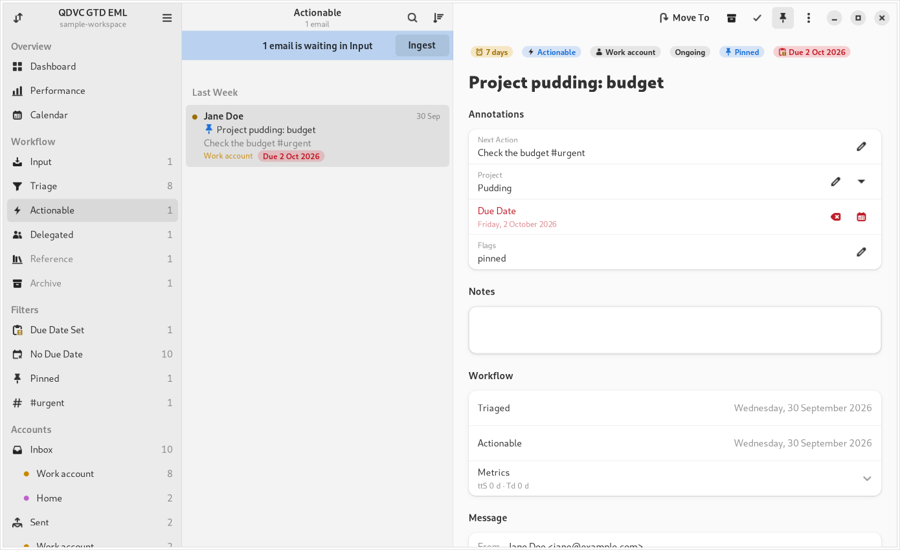

# QDVC GTD EML for GNOME

A native GTK 4 / libadwaita app for working a Getting Things Done workflow over
`.eml` files on GNOME. It opens a
[qdvc-gtd-eml](https://github.com/qdvc-apps/qdvc-gtd-eml) workspace, shows it
in a Geary-style three-pane window, and performs the command-line tool's
workflow actions directly on the workspace — with the CLI's own code, so the
files and `metadata.csv` it writes are exactly the CLI's. Neither needs the
other. It is the GNOME counterpart of
[qdvc-gtd-eml-mac](https://github.com/qdvc-apps/qdvc-gtd-eml-mac).



- **Sidebar:** Overview (Dashboard, Performance, Calendar), the six Workflow
  folders with counts, Filters (due date set, no due date, pinned, one per
  monitored hashtag), and Inbox and Sent per own account.
- **Message list:** correspondent, date, subject, the next action as the
  preview line, an age dot, the account and a due-date tag, under date
  headings. Multi-select with Ctrl/Shift-click; right-click for the message
  menu; drag messages onto a folder to move them.
- **Reading pane:** the annotations, edited in place (Enter applies a field,
  Escape reverts; due dates with a calendar picker), notes, the workflow
  trail and metrics, and the thread split into its quoted messages.
- **Actions:** Ingest (Ctrl+Shift+N), Move To (Ctrl+2…6, Ctrl+M for the
  menu), Archive (Ctrl+6), Close With… (Ctrl+K), Pin (Ctrl+D), Edit
  Annotations (Ctrl+E), Review Date Stamps… (`workflow_autofix`), Check
  Metadata… (`metadata_check`). The CLI's refusals apply, in its wording.
  Press Ctrl+? for every shortcut.
- **Performance:** the open backlog and weekly or monthly throughput, per
  account. **Calendar:** a month heatmap of what happened each day.
- Changes made by the CLI (or anything else) appear by themselves; drop
  `.eml` files on the window to add them to Input.
- Adaptive down to phone width; follows the system's light/dark style.

## Requirements

GNOME 46 or later: Python 3.10+, GTK 4.14+, libadwaita 1.5+, PyGObject with
cairo support, and PyYAML.

```
sudo apt install python3-gi python3-gi-cairo gir1.2-gtk-4.0 gir1.2-adw-1 python3-yaml   # Debian, Ubuntu 24.04+
sudo dnf install python3-gobject python3-cairo gtk4 libadwaita python3-pyyaml          # Fedora 40+
```

## Install, rebuild, run

```
scripts/build-app.sh --install    # check, test, install for this user, refresh GNOME
scripts/build-app.sh              # check and test only (stages build/qdvc-gtd-eml)
scripts/build-app.sh --run [dir]  # run from the checkout, without installing
scripts/build-app.sh --uninstall
```

`--install` (no root needed) copies the app to
`~/.local/share/qdvc-gtd-eml/`, writes the command `~/.local/bin/qdvc-gtd-eml`,
installs the launcher `~/.local/share/applications/qdvc.GtdEml.desktop` and
the icons, and quits a running copy, so after a rebuild the next launch from
Activities or the Dock runs the new code. Add `--no-test` to skip the tests.
The installed copy is independent of the checkout.

The launcher is named after the application id (`qdvc.GtdEml`) so that GNOME
Shell on Wayland matches the window to it; `StartupWMClass=qdvc-gtd-eml`
covers X11. To check it: `desktop-file-validate
~/.local/share/applications/qdvc.GtdEml.desktop`.

Try it on `sample-workspace/` (a copy is safest: the app writes to the
workspace it opens).

## Workspace settings

Accounts, monitored hashtags, the age-colour thresholds and the filename
length come from `workspace.yml` in the workspace, which the CLI reads too
(Preferences → Workspace shows them). The app's own preferences — date
format, time zone, on-radar folders — are in Preferences (Ctrl+,) and stored
in `~/.config/qdvc-gtd-eml/config.yml`.

## Documentation

- [docs/DESIGN.md](docs/DESIGN.md): the design and the decisions taken.
- [docs/MAINTENANCE.md](docs/MAINTENANCE.md): code layout, the vendored CLI
  core, preserved behaviour, tests, and deviations from the QDVC spec.
- [docs/FILE_FORMAT.md](docs/FILE_FORMAT.md): the workspace format.
- [docs/screenshots/](docs/screenshots/): every page, light and dark.

## License

No license has been chosen yet. Add a `LICENSE` file before publishing.
